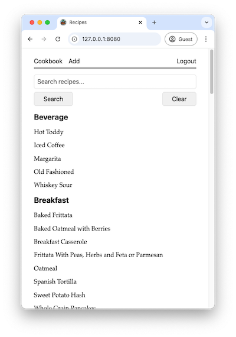
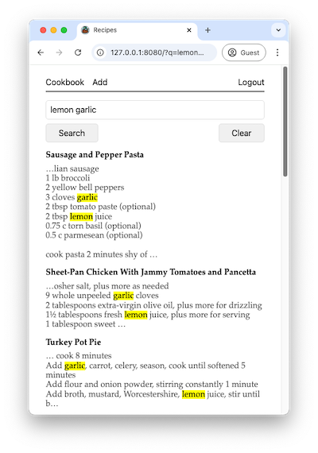
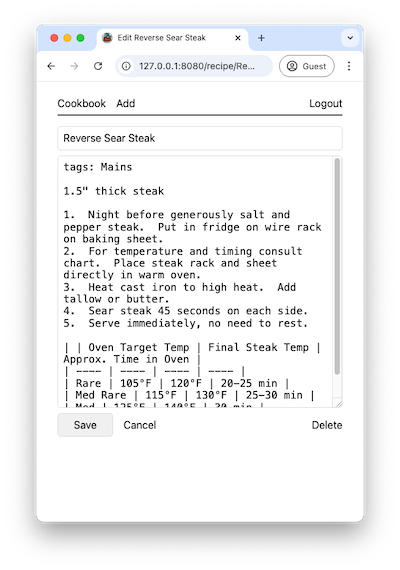
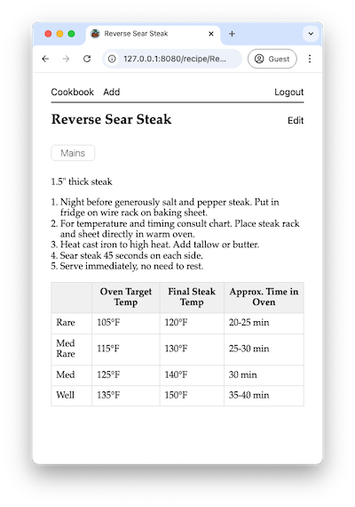

# Cookbook

A server to share, search, and edit recipes.





## Features

- Mobile friendly search and editing of recipes.
- Recipes are stored as [markdown](https://docs.github.com/en/get-started/writing-on-github/getting-started-with-writing-and-formatting-on-github/basic-writing-and-formatting-syntax) files.
- [GitHub Flavored Markdown Tables](https://docs.github.com/en/get-started/writing-on-github/working-with-advanced-formatting/organizing-information-with-tables) are supported.
- Markdown is extended so if a line starts with `tags:` a list of tags can be provided which will group the recipes on the main page.  Ex. `tags: Side, Vegetable`.
- Upon startup and file changes recipes are indexed into the full text search index. 
- Configuration options:
  - No authentication.  Edit the recipe files on your server, the server will recognize changes and be viewable in the browser.  Cannot create or edit from the browser.
  - Authentication.  When configured an `Edit` link will appear where you will be able to edit recipes in the browser.
    - Form based authentication.  Edit the [config.toml](config.toml#L19-20) `FormBasedAuthUsers` section. 
    - [OpenID Connect](https://en.wikipedia.org/wiki/OpenID#OpenID_Connect_(OIDC)).  Connect to an OIDC provider such as [Authentik](https://goauthentik.io/).  Configure the [config.toml](config.toml#L12-17) `OIDC` section.

## Requirements
- [go](https://go.dev/doc/install)
- [air](https://github.com/air-verse/air) (optional, for development)
- [caddy](https://caddyserver.com/docs/install) (optional, easy way to add https)

## Quick Start
1.  Install [go](https://go.dev/doc/install), [caddy](https://caddyserver.com/docs/install).
2.  Copy and edit [config-example.toml](config-example.toml) to `config.toml`.
3.  `caddy run --config Caddyfile`
4.  `./build.sh`
5.  `./cookbook -c config.toml`
6.  Open browser to [https://127.0.0.1:8081/](https://127.0.0.1:8081/)

## Development
Development expects your config file to be called `config.toml`.
```sh
air
caddy run --config Caddyfile
```

## Production
```sh
./build.sh
./cookbook -c config.toml
```

## Docker Example
[Dockerfile](Dockerfile) and [docker-compose.yaml](docker-compose.yaml) are provided for example.
```sh
./build.sh
docker compose up -d --build
```
